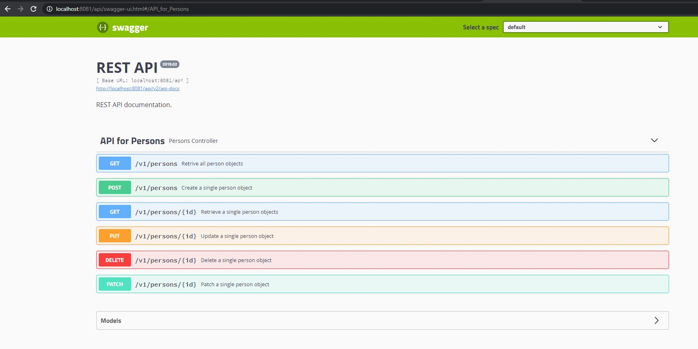

<br />
<p align="center">
  <a href="https://github.com/varunhkulkarni/embl">  
  </a>

  <h3 align="center">EMBL Project : Person API + Eureka Server + Zuul gateway + Zuul Ratelimiter + Docker Configuration </h3>

  <p align="center">
    Docker project to host the person api using the Eureka servers and Zull Gateway 
    <br />
    <a href="https://github.com/othneildrew/Best-README-Template"><strong>Explore the docs »</strong></a>
    <br />
    <br />
  </p>
</p>


<!-- TABLE OF CONTENTS -->
<details open="open">
  <summary>Table of Contents</summary>
  <ol>
    <li>
      <a href="#about-the-project">About The Project</a>
      <ul>
        <li><a href="#built-with">Built With</a></li>
      </ul>
    </li>
    <li>
      <a href="#getting-started">Getting Started</a>
      <ul>
        <li><a href="#prerequisites">Prerequisites</a></li>
        <li><a href="#run-application-on-docker-with-pre-tagged-images">Run application on docker with pre-tagged images</a></li>
        <li><a href="#build-and-run-locally">Build and Run locally</a></li>
      </ul>
    </li>
    <li><a href="#usage">Usage</a></li>
    <li><a href="#docker-images">Docker Images</a></li>
    <li><a href="#contact">Contact</a></li>
  </ol>
</details>


<!-- ABOUT THE PROJECT -->
## About The Project

This is project will demonstrate the complete the functionalities for exposing a restful web-service using : Spring Rest web-services with Netflix Eureka Services with Zuul API gateway
Below features are implemented in this project :

* To expose the Persons API using the Spring restful API - Person Controller haas the following CRUD operations : GET, GETALL, SAVE, UPDATE, DELETE
* To enable the documentation using the Swagger framework
* To enable the security for the API using spring security 
* To expose the person-service using the Zuul API
* To use the Eureka Server as load balancers to add new person-service instances to scale up or scale down
* To dockerize the whole project into one container to run complete project in single server

### Following things are considered while implmentating the Service :

1. To expose the Restful web services -> Spring BOOT with Spring REST and Spring JPA
2. Testing -> Junit
3. Security -> Sprign Security
4. Scalibity -> Euraka Servers for scalinh up/down the the servies 
5. Limitation -> Netflix Zuul rate limiter 
6. Documentation -> Swagger
7. Deployment -> Docker

### Built With

* [JAVA 8]
* [Spring Boot/Rest/JPA]
* [Netflix Eureka]
* [Netflix Zuul - API Gateway + Rate limiter]
* [Docker]

<!-- GETTING STARTED -->
## Getting Started

This section will help to configure and run the project using the docker contatiners and also to locally 

### Prerequisites

Following softwares should be installed on the computer 

1. JAVA 8 
2. MAVEN
3. DOCKER

### Run application on docker with pre-tagged images

To run the this project on docker containers :

1. Copy the file : <b>docker-compose.yml</b> present at location onto your local machines 

  ```sh
   https://github.com/varunhkulkarni/embl/tree/main/docker-images
   ```
2. Execute the command from the location where the <b>docker-compose.yml</b> is cloned on local computer  : 

 ```sh
   docker-compose up &
   ```
   
3. Access the application once its up on the below URL : 

  ```sh
  http://localhost:8081/api/swagger-ui.html#/API_for_Persons
  ```
  
### Build and Run locally

Follow the below steps to build and run locally the project 

1. Clone the repo
  ```sh
   git clone https://github.com/varunhkulkarni/embl.git
   ```

2. Go to the individual projects and run the maven clean install command from command prompt

 ```sh
  mvn clean install
  ```
  
  If the you are running docker for the first time then :
  
  ```sh
  Open the docker setting 
  Go to -> General tab
  Select : Expose daemon on tcp://localhost:2375 without TLS
  ```
    
3. Check if the docker services are running fine. 

4. Run the all the images together from prject docker-images
  
  To start the project into docker :

  ```sh
  docker-compose up &
  ```
  
  To stop the project :
  
  ```sh
  docker-compose down
  ```
5. If you want to scale up the embl-person-service to 3 nodes

 ```sh
  docker-compose up --scale embl-person-service=3
  ```
  
 <!-- USAGE -->
## Usage

This section will help to query differnt URLs to use the API that we have started with the above code

1. URL for Eureka Server : 

  ```sh
  http://localhost:8761/
  ```
  
2. To Open the Person controller using Zuul and Swagger

  ```sh
  http://localhost:8081/api/swagger-ui.html#/API_for_Persons
  ```
<!-- Docker Images -->
## Docker Images

Docker images for this application can be found in the docker hub repository on the below link :

  ```sh
  https://hub.docker.com/r/varunhkulkarni/embl
  ```


## Contact

Varun Kulkarni- 

Project Link: [https://github.com/varunhkulkarni/embl](https://github.com/varunhkulkarni/embl)





  
